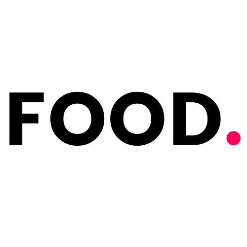
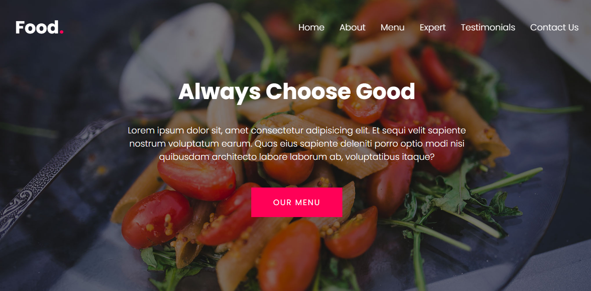
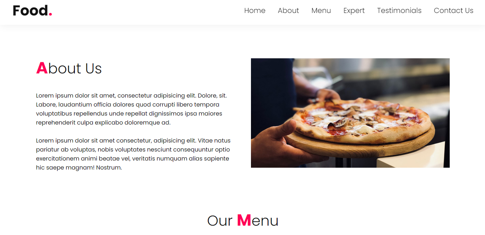
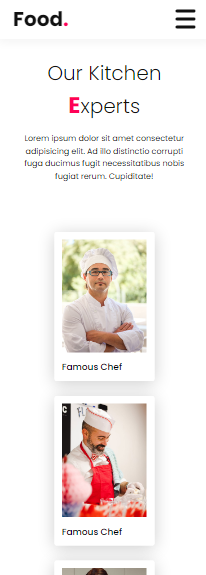
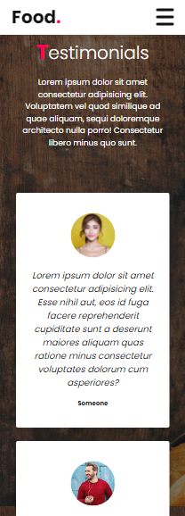
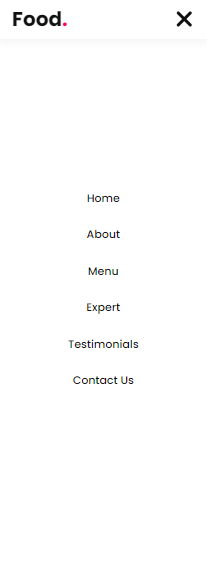
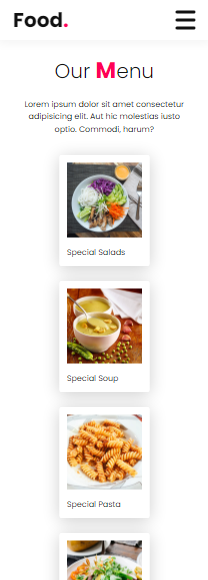

<h1 align="center">
    
</h1>

# ✉ About

A completely responsive website for a fictional food company  🍕🍝.

# 🌆 GIFs and images

## GIF


# Desktop Screenshots

<div>
    
    
</div>

# Mobile Screenshots

<div display="flex">
    
    
    
    
</div>

# 👨‍💻👩‍💻 Use the app

You can access the application by clicking on the link below:

[Access Food](https://food-al.vercel.app)

# 💻 Technologies used in this project

- HTML 
- CSS
- JavaScript

# ❓ How to use it

```bash

git clone https://github.com/arthur-lage/food.git

cd food

```